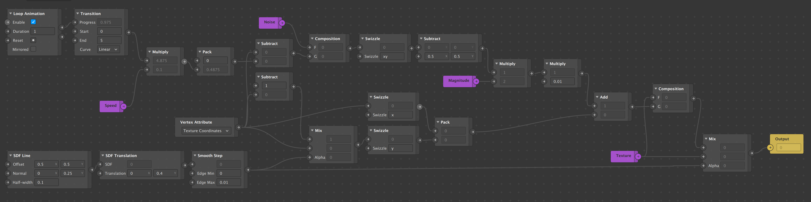
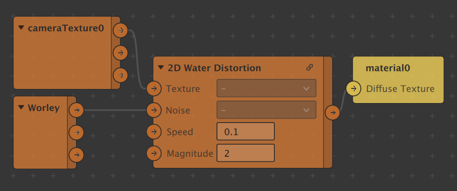

# Water Distortion With Script

Source: https://www.shadertoy.com/view/XdKSRd

This filter project translated the water distortion effect from openGL code in shader toy to Spark AR Javascript. 

Visit www.gowaaa.com to learn more about what we do!

# Water Distortion With Patches

Visit https://github.com/keerotic/arp to get more PATCH ASSETS